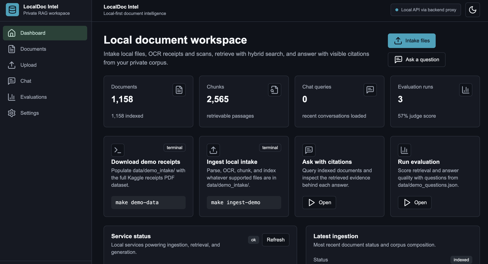
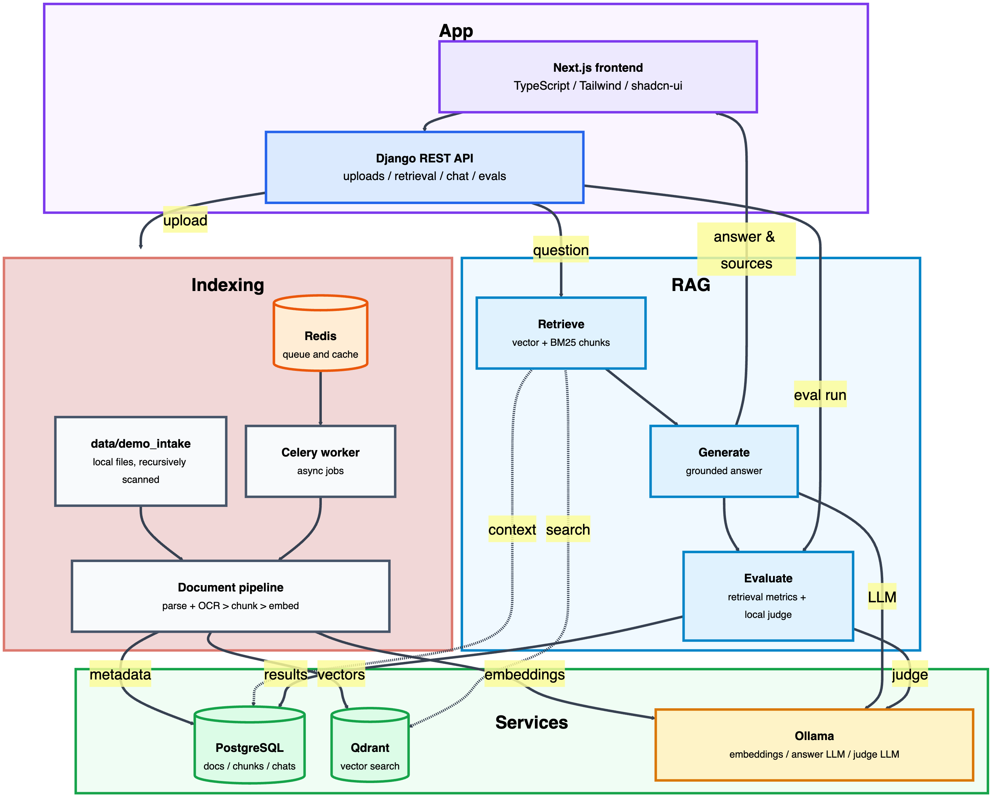

# LocalDoc Intel

**Local-first document intelligence: upload private documents, ask questions, get cited answers — with no data ever leaving your machine.**

[](.github/workflows/ci.yml)
[](https://www.python.org/)
[](https://www.djangoproject.com/)
[](https://www.django-rest-framework.org/)
[](https://nextjs.org/)
[](https://react.dev/)
[](https://www.typescriptlang.org/)
[](https://tailwindcss.com/)
[](https://www.postgresql.org/)
[](https://redis.io/)
[](https://qdrant.tech/)
[](https://docs.celeryq.dev/)
[](https://ollama.com/)
[](LICENSE)

LocalDoc Intel is a local AI assistant for searching and understanding personal or business documents. Users can add their own files, ask natural-language questions, and get answers grounded in the uploaded documents. Every response includes citations to the source material, making it easier to verify the answer and trust the result.

The application is built around privacy, reproducibility, and clarity: documents are processed locally, answers are tied back to evidence from your input, and the codebase is structured for maintainability, testing, and future expansion.



## Use cases

LocalDoc Intel fits anywhere you have a pile of documents that are too sensitive, too messy, or too numerous to search by hand:

- **Personal finance dump** — drop years of scanned receipts, invoices, and statements into the intake folder and ask "How much was the Amtrak ticket in September 2022?" or "Which receipts include VAT?" — totals and merchants come back with the source receipt cited.
- **Employee onboarding** — index the internal handbook, runbooks, and policy docs so new hires can ask "How do I request access to the dev environment?" and get the exact paragraph instead of pinging a teammate.
- **Contracts and legal archives** — search leases, agreements, and amendments by meaning ("What is the termination notice period?") rather than exact keywords, with page-level citations for verification.
- **Research and meeting notes** — turn scattered Markdown notes, exports, and email threads into a searchable knowledge base that answers "What did we decide about the Q3 pricing change?"
- **Compliance and audits** — everything runs on your hardware, so regulated documents never leave the machine; answers cite document, page, and line so findings are verifiable.


## Stack at a glance

| Layer | Tools |
|---|---|
| Backend API | Django 5.2.15, Django REST Framework 3.17.1, psycopg 3.3.4 |
| Frontend | Next.js 16.2.10, React 19.2.7, TypeScript 5.5, Tailwind CSS 3.4, shadcn/ui-style components |
| Retrieval | Qdrant 1.18, BM25 keyword search, hybrid retrieval, optional reranking |
| Local AI | Ollama, Qwen3 Embedding 0.6B, Qwen3 4B Instruct GGUF for answers and judging |
| OCR and parsing | Tesseract OCR, pypdf 6.14.2, document/table/markup extractors |
| Jobs and storage | Celery 5.6.3, Redis 8, PostgreSQL 18 |
| Quality | pytest 9.1.1, Vitest 2.0.5, Ruff 0.15.20, Black 26.5.1, GitHub Actions |

## Features

- Browser upload and folder ingestion for PDFs, images, Office files, text, Markdown, CSV/TSV, JSON/JSONL, markup, logs, and email-like files with per-file error reporting.
- Lightweight local OCR through Tesseract for image files and scanned PDFs without a text layer.
- Line-, page-, and byte-accurate chunking (Python, with an optional C++ chunker for large text files).
- Local embeddings (Qwen3-Embedding-0.6B via Ollama) indexed in Qdrant.
- Vector, BM25 keyword, hybrid (vector + BM25), and metadata-filtered retrieval with optional reranking.
- Cited answers from a local LLM: every claim carries a `[n]` marker mapping to a retrieved chunk with document, page/line range, and score.
- Graceful degradation: if Ollama is down, the API returns an extractive answer built from the top retrieved passages instead of failing.
- Asynchronous vector indexing through Celery with an inline fallback when no worker is running.
- Evaluation harness: Recall@k, MRR, citation coverage, groundedness, local LLM answer-quality judging, and latency, persisted as evaluation runs and shown in the UI.
- Service status endpoint and dashboard indicators for Postgres, Redis, Qdrant, Ollama, and pulled models.
- Fully containerized dev environment; backend, frontend, and C++ chunker tested in CI without any live model calls.

## Architecture



The pipeline layers are modular and injectable: `EmbeddingProvider`, `VectorStore`, and `Reranker` are protocol interfaces in `backend/retrieval/services.py`, and answer generation lives in `backend/chat/generation.py`. Tests substitute fakes for all of them.

## RAG flow

1. **Upload** — files are validated (unsupported types and empty documents rejected with clear errors), hashed, and stored.
2. **Parse** — PDFs are extracted per page (pypdf), scanned PDFs and images can use local Tesseract OCR, tables/JSON/markup/Office files are converted into readable text, and text/code files keep page/line metadata where available.
3. **Chunk** — line-aware chunking with configurable size/overlap; large text files can use the C++ chunker.
4. **Embed + index** — chunks are embedded by the local embedding model and upserted into Qdrant (async via Celery, or inline).
5. **Retrieve** — the question is embedded and matched against Qdrant (vector), scored with BM25 keyword search, merged in hybrid mode, or filtered by metadata; optional reranking.
6. **Generate** — the local LLM receives numbered source context and must answer with inline `[1]`-style citations. No retrieval hits → honest "no results" response. Ollama down → extractive fallback.
7. **Cite** — the API returns each source's document, chunk, page, line range, score, and preview alongside the answer.

## Local models

Default models are Hugging Face-sourced and served through Ollama, so inference never leaves your machine. They are downloaded during `make setup` — not shipped in the repo — and are swappable in `.env`.

| Role | Default | Why |
|---|---|---|
| Embeddings | [`qwen3-embedding:0.6b`](https://huggingface.co/Qwen/Qwen3-Embedding-0.6B) (1024-dim) | Top-tier MTEB retrieval quality for its size, 100+ languages, Apache-2.0, ~640MB |
| LLM + eval judge | [`hf.co/unsloth/Qwen3-4B-Instruct-2507-GGUF:Q4_K_M`](https://huggingface.co/unsloth/Qwen3-4B-Instruct-2507-GGUF) | Strong instruction-following and citation discipline per GB; runs on 8GB RAM; Apache-2.0; pulled directly from Hugging Face by Ollama |

```bash
make models   # pulls the configured embedding, answer, and judge models
```

To swap models, edit `.env`:

```bash
# Any Ollama model or any GGUF repo on Hugging Face works:
LLM_MODEL=hf.co/<org>/<repo>-GGUF:<quant>
EVAL_JUDGE_MODEL=hf.co/<org>/<repo>-GGUF:<quant>
EMBEDDING_MODEL=<any-ollama-embedding-model>
QDRANT_VECTOR_SIZE=<your embedding model's output dimension>
```

If you change the embedding model or vector size, re-ingest (or re-index) your documents so stored vectors match.

## Quickstart

Prerequisites: Docker (with Compose), [Ollama](https://ollama.com) running on the host, and ~4GB of disk for models.

```bash
git clone <your-fork-url> && cd localdoc-intel
make setup        # copies .env.example → .env, pulls models, builds containers, migrates
make launch       # start services, wait for backend/proxy readiness, migrate, and open the frontend
make demo-data    # copy Kaggle receipt PDFs into data/demo_intake/
make ingest-demo  # index the current local files in data/demo_intake/
make eval         # run retrieval metrics and local answer-quality judging
```

Frontend: <http://localhost:3000> · API health: <http://localhost:8000/api/health/> · Service status: <http://localhost:8000/api/status/>

### Local intake demo

`make demo-data` uses `kagglehub.dataset_download("jenswalter/receipts")` and copies all receipt PDFs found in the KaggleHub dataset cache into `data/demo_intake/`. It only copies original PDF files; it does not use `kagglehub.load_dataset(...)`.

You can replace those files with any local documents you want to test, then rerun `make ingest-demo`. Intake files are ignored by Git and are not redistributed. The ingestion command recursively scans `data/demo_intake/`, skips hidden, temporary, empty, and unsupported files, prints a green terminal progress bar for each supported file, logs failed files as they happen, and finishes with a summary of discovered, ingested, skipped, unsupported, and failed files. The full receipts dataset contains many scanned PDFs, so OCR can take a while on smaller machines. Browser uploads show the same intake lifecycle with a green progress bar while files are uploaded and processed.

| Intake category | Supported formats | Extraction behavior |
|---|---|---|
| PDFs | `.pdf` | Extract embedded text per page; fall back to OCR for scanned pages when needed |
| Images | `.png`, `.jpg`, `.jpeg`, `.tif`, `.tiff`, `.bmp`, `.webp` | Run local Tesseract OCR directly |
| Plain text | `.txt`, `.md`, `.rst`, `.log` | Read text directly with line-aware chunk metadata |
| Tables | `.csv`, `.tsv` | Convert rows into readable table text |
| Structured data | `.json`, `.jsonl` | Flatten readable fields into text chunks |
| Office XML | `.docx`, `.xlsx`, `.xlsm`, `.pptx` | Extract paragraphs, tables, workbook sheets, slides, rows, and cell values where available |
| Markup and config | `.html`, `.htm`, `.xml`, `.yaml`, `.yml` | Strip markup or read text-like config content |
| OpenDocument | `.odt`, `.ods` | Best-effort text extraction from OpenDocument packages |
| Email and rich text | `.eml`, `.rtf` | Extract headers/body or readable rich-text content |
| Legacy Office | `.doc`, `.xls`, `.ppt` | Best-effort conversion when LibreOffice is available; otherwise skipped with a clear error |
| Outlook message | `.msg` | Convert to PDF, EML, or text first |

Demo questions live in `data/demo_questions.json`. The open-ended entries ask corpus-level questions (document types, merchants, currencies, OCR quality); the labeled entries (`expected_document`/`expected_terms`) target specific Kaggle receipt files so retrieval metrics have something to measure out of the box. Edit or replace them when testing your own documents.

Runtime tuning is local and resource-aware by default: the backend detects container CPU and memory limits, uses conservative defaults for OCR DPI/timeouts and worker counts, and exposes the active values on the Settings page. Pin `OCR_PDF_DPI`, `OCR_TIMEOUT_SECONDS`, `INGESTION_MAX_WORKERS`, or `CELERY_WORKER_CONCURRENCY` in `.env` only when you want to override those defaults.

### API examples

```bash
curl http://localhost:8000/api/status/
curl -X POST http://localhost:8000/api/chat/query/ \
  -H "Content-Type: application/json" \
  -d '{"question":"What should be validated before deployment?","retrieval_mode":"hybrid","top_k":5,"rerank":true}'
```

## Evaluation

The harness (`backend/evaluations/harness.py`) runs editable demo questions through the real retrieval pipeline, generates answers, and scores answer quality with the configured local Ollama judge model. Questions may be open-ended, or they may include `expected_document` and `expected_terms` for regression-style retrieval metrics.

- **Recall@k / hit rate** — expected document appears in the top-k chunks.
- **MRR** — reciprocal rank of the first chunk from the expected document.
- **Citation coverage** — fraction of expected key terms present in retrieved text.
- **Groundedness** — questions where at least half the expected terms are covered.
- **Answer quality** — local LLM score for correctness, completeness, citation use, and grounding.
- **Latency** — mean retrieval time per question.

```bash
make eval                                   # full run: retrieval + generation + judging
make eval-fast                              # retrieval metrics only (no LLM calls, seconds)
python manage.py run_eval --mode vector     # compare retrieval modes
python scripts/benchmark_retrieval.py       # latency benchmark across modes
```

The full run makes two local LLM calls per question (answer + judge), so it is bound by your hardware's inference speed; the progress bar reports each stage (retrieved → generating → judging) with per-stage timings. Response lengths are capped via `LLM_MAX_ANSWER_TOKENS` and `EVAL_JUDGE_MAX_TOKENS`, and `OLLAMA_KEEP_ALIVE` keeps models warm between questions — tune them in `.env` if needed.

Retrieval-rank metrics (Recall@k, MRR) are computed only over questions that declare an `expected_document`, and coverage/groundedness only over questions with expectations; open-ended questions are judged for answer quality but reported as **n/a** for those metrics rather than counted as misses.

Runs are persisted and visible on the Evaluations page. The demo set lives in `data/demo_questions.json` and can be edited directly for your current intake folder.

## Testing

```bash
make test    # backend: pytest (model and network calls mocked)
make lint    # ruff + eslint
make format  # black + ruff --fix + prettier
make cpp-test
npm --prefix frontend run test
```

CI (GitHub Actions) runs backend lint + tests against Postgres/Redis services, frontend lint + tests + build, and the C++ chunker build + tests. No job requires a model or network inference.

## Maintenance

```bash
make reset   # clear caches and build artifacts, keep data/volumes/.env, restart the app
make clean   # pristine wipe: containers + volumes, caches, node_modules, demo data, media, .env
```

`make reset` is the quick recovery path after debugging or code changes. `make clean` returns the working tree to a push-ready state; rebuild afterwards with `make setup && make demo-data`.

## Privacy boundaries

- Documents, chunks, vectors, chat history, and evaluation results live only in local Postgres, Qdrant, and disk storage.
- All inference goes through Ollama on your machine; there are no cloud-provider code paths, API keys, or telemetry.
- `.env.example` contains example values only; `.env` is gitignored. Nothing secret is committed.
- The only network access needed for inference is the setup-time model download from Hugging Face/Ollama during `make setup` or `make models`.
- `make demo-data` may use network access to download the optional Kaggle receipt sample. If KaggleHub is missing or Kaggle requires authentication, consent, accepted terms, or network access, the command prints a skip message and leaves the rest of the app untouched.

## Project structure

```
backend/                    Django REST API: documents, retrieval, chat, evaluations
  chat/generation.py        LLM answer generation with source instructions + fallback
  retrieval/services.py     embedding/vector-store/reranker interfaces + retrieval
  documents/ingestion.py    parse → chunk → store → (async) index
  evaluations/harness.py    retrieval metrics harness
frontend/    Next.js app: dashboard, documents, upload, chat, evaluations, settings
cpp/chunker/ optional C++ line-aware chunker (JSONL out)
data/        editable demo questions; gitignored demo_intake and external data folders
examples/    tiny synthetic parser examples, not the default intake source
scripts/     folder ingestion, evaluation, retrieval benchmark
docs/        architecture, RAG design, evaluation, model card
```

## Limitations

- Single-user by design; no auth layer.
- OCR quality depends on Tesseract and source image quality.
- Local answer-quality judging expects the configured judge model to be pulled by setup and Ollama to be running.

## Interview summary

> LocalDoc Intel is a local-first RAG system I built end-to-end: a Django REST backend with a modular retrieval pipeline (protocol-based embedding, vector store, and reranker interfaces), a typed Next.js frontend, and a fully local model stack — Qwen3 embeddings and a Hugging Face-sourced Qwen3-4B GGUF served by Ollama. The interesting engineering problems were (1) citation-accurate chunking that preserves page/line/byte provenance from parser/OCR to UI, (2) graceful degradation so the product works with any subset of services running — extractive answers when the LLM is down, inline indexing when the Celery worker is absent, BM25 retrieval when Qdrant is empty — and (3) an evaluation harness that runs retrieval metrics and local LLM answer-quality judging after setup has pulled the configured models.

## Licensing

This project is **Source Available**, not OSI Open Source. It is licensed under the [PolyForm Noncommercial License 1.0.0](LICENSE).

In plain English, you can read, use, copy, modify, merge, publish, and distribute the code for noncommercial purposes, including personal study, research, education, public-interest work, and internal noncommercial experimentation.

The license grants rights **only** for noncommercial purposes ("Any noncommercial purpose is a permitted purpose" is the entire grant — commercial use is simply never licensed, so it remains prohibited by default under copyright law). Concretely, you may **not** sell this software, sell modified versions of it, offer it as a paid hosted service, include it in a paid product, or otherwise use it for commercial advantage. Use inside a for-profit business also requires a separate commercial license from the author.

**Attribution is required.** Under the license's Notices clause, anyone who redistributes any part of this software — original or modified, on GitHub or anywhere else — must include the license terms and the plain-text line:

> Required Notice: Copyright 2026 Jonathan Serrano (https://github.com/jonserr)

Removing or obscuring that attribution to the original author is a license violation that terminates the redistributor's rights.

This summary is provided for convenience only. The full legal terms are in [LICENSE](LICENSE).
