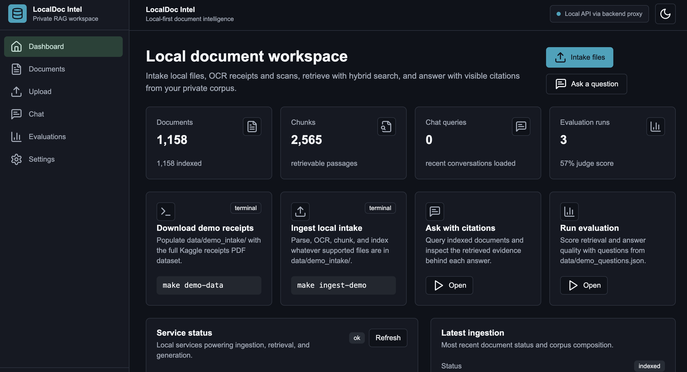
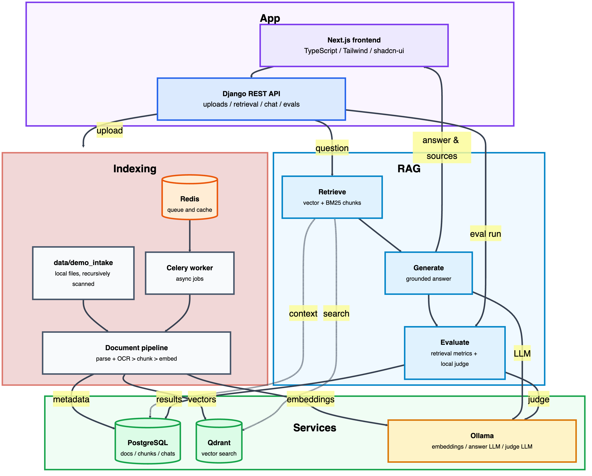

# LocalDoc Intel

**Local document intelligence. Upload your documents, ask questions in plain language, and get answers with citations back to the source passage. Every service runs on your own machine.**

LocalDoc Intel indexes the files you give it and answers questions about them. It runs the whole retrieval pipeline locally: parsing, OCR, chunking, embeddings, hybrid search, and answer generation through Ollama. Every answer names the document, page, and line range it came from, so you can check it.

The defaults keep all processing on your machine and publish nothing beyond loopback. See [Privacy](#privacy) for the exact boundary.



## What it does

- Upload files in the browser, or put them in a folder and run one command.
- Read PDFs, images, Office files, text, Markdown, CSV/TSV, JSON/JSONL, markup, logs, and email files. Each failed file reports its own error.
- Run local OCR through Tesseract for image files and scanned PDFs.
- Chunk text with line, page, and byte accuracy. A C++ fast path handles eligible text and code files larger than 4 MiB.
- Embed chunks locally with Qwen3-Embedding-0.6B and index them in Qdrant.
- Search by vector, BM25 keywords, both together (reciprocal rank fusion), or metadata filter. Reranking is optional.
- Answer from a local LLM with `[n]` citation markers. The backend rejects an answer that cites a source it did not receive.
- Return extractive passages when Ollama is down, and BM25 results when the vector index is empty.
- Index in the background through Celery, with per-document state (queued, running, succeeded, failed) and a reindex action.
- Measure retrieval quality with a built-in evaluation harness.
- Report the health of Postgres, Redis, Qdrant, Ollama, and pulled models on the dashboard.

## How it works



1. **Upload** — the API validates the file, rejects unsupported and empty files, hashes it, and stores it.
2. **Parse** — pypdf extracts PDF text per page. Tesseract reads images and scanned pages. Tables, JSON, markup, and Office files convert to readable text. Text and code files keep their page and line metadata.
3. **Chunk** — line-aware chunking with configurable size and overlap. Eligible text and code files larger than 4 MiB use the C++ offset chunker.
4. **Embed and index** — the local embedding model embeds each chunk. Celery upserts the vectors into Qdrant, or the app indexes inline.
5. **Retrieve** — the app embeds the question, searches Qdrant, scores BM25 keywords, merges both in hybrid mode, and reranks on request.
6. **Generate** — the local LLM receives numbered sources and answers with inline `[1]` markers. Zero hits returns a plain "no results" answer.
7. **Cite** — the response carries each source document, chunk, page, line range, score, and preview.

Postgres holds the chunk text, offsets, and provenance. Qdrant holds the vectors and a payload copy for filtering. Delete the Qdrant collection and the corpus stays intact. Run reindex to rebuild it.

## Stack

| Layer | Tools |
|---|---|
| Backend API | Django 5.2.15, Django REST Framework 3.17.1, psycopg 3.3.4 |
| Frontend | Next.js 16.3.4, React 19.2.7, TypeScript 5.5, Tailwind CSS 3.4, shadcn/ui-style components |
| Retrieval | Qdrant 1.18, BM25 keyword search, hybrid retrieval, optional reranking |
| Local AI | Ollama, Qwen3 Embedding 0.6B, Qwen3 4B Instruct GGUF for answers and judging |
| OCR and parsing | Tesseract OCR, pypdf 6.14.2, document/table/markup extractors |
| Jobs and storage | Celery 5.6.3, Redis 8, PostgreSQL 18 |
| Quality | pytest 9.1.1, Vitest 5.0.0, Ruff 0.15.20, Black 26.5.1, local Make release checks |

The pipeline layers are injectable. `EmbeddingProvider`, `VectorStore`, and `Reranker` are protocol interfaces in `backend/retrieval/services.py`. Answer generation lives in `backend/chat/generation.py`. Tests substitute fakes for all of them.

## Quickstart

Prerequisites: Docker with Compose, [Ollama](https://ollama.com) running on the host, and about 4 GB of disk for models.

```bash
git clone https://github.com/jonserr/localdoc-intel.git && cd localdoc-intel
make setup        # copy .env.example → .env, pull models, build containers, migrate
make launch       # start services, wait for readiness, migrate, open the frontend
make demo-data    # copy Kaggle receipt PDFs into data/demo_intake/
make ingest-demo  # index the local files in data/demo_intake/
make eval         # run retrieval metrics and local answer-quality judging
```

Frontend: <http://127.0.0.1:3000> · API health: <http://127.0.0.1:8000/api/health/> · Service status: <http://127.0.0.1:8000/api/status/>

Compose publishes those two ports on `127.0.0.1` only, so the rest of the network cannot reach them. Postgres, Redis, and Qdrant get no host port at all. Containers reach them over the Compose network.

### Development or everyday use

The default stack is the development one. It mounts the sources, runs the Django development server and `next dev`, and carries the test and lint tooling. Use it while you change the code.

```bash
make prod-up     # everyday use: runtime images, gunicorn, Next standalone server
make prod-down   # stop it
```

The runtime images carry the application and its runtime dependencies only. They collect static files at build time, run as a non-root user, keep uploads in a named volume, and force `DJANGO_DEBUG` off. Both stacks publish the same two ports, so stop one before you start the other.

## Local models

The default models run through the local Ollama endpoint. `make setup` downloads them. They are not shipped in the repo, and you can swap them in `.env`.

| Role | Default | Configuration |
|---|---|---|
| Embeddings | [`qwen3-embedding:0.6b`](https://huggingface.co/Qwen/Qwen3-Embedding-0.6B) (1024-dim) | Output size must match `QDRANT_VECTOR_SIZE` |
| LLM + eval judge | [`hf.co/unsloth/Qwen3-4B-Instruct-2507-GGUF:Q4_K_M`](https://huggingface.co/unsloth/Qwen3-4B-Instruct-2507-GGUF) | GGUF model served through Ollama. Answer generation and judging share this default |

```bash
make models   # pull the configured embedding, answer, and judge models
```

To swap models, edit `.env`:

```bash
# Choose models supported by your Ollama installation:
LLM_MODEL=hf.co/<org>/<repo>-GGUF:<quant>
EVAL_JUDGE_MODEL=hf.co/<org>/<repo>-GGUF:<quant>
EMBEDDING_MODEL=<any-ollama-embedding-model>
QDRANT_VECTOR_SIZE=<your embedding model's output dimension>
```

Ollama can route a model tagged `:cloud` to its own hosted service. The app refuses such a name in `EMBEDDING_MODEL`, `LLM_MODEL`, or `EVAL_JUDGE_MODEL` at startup, and the Service status card reports any cloud entry your Ollama lists. Disable the feature at its source as well, because that is what enforces it:

```bash
# macOS: set it for the Ollama app, then restart Ollama
launchctl setenv OLLAMA_NO_CLOUD 1
# Linux: systemctl edit ollama.service, add under [Service]:
#   Environment="OLLAMA_NO_CLOUD=1"
```

The Ollama server log then reports `Ollama cloud disabled: true`.

Reindex every document after you change the embedding model. If the output dimension changes, create a new Qdrant collection with the matching `QDRANT_VECTOR_SIZE` first. The app does not migrate an existing collection's dimension. See [docs/model_card.md](docs/model_card.md).

## Adding your own documents

`make demo-data` downloads the Kaggle receipts sample into `data/demo_intake/`. Replace those files with any local documents and run `make ingest-demo` again. The command scans the folder, skips hidden, temporary, empty, and unsupported files, shows a progress bar, logs each failure, and prints a summary. Intake files stay out of Git. Browser uploads show the same lifecycle.

| Intake category | Supported formats | Extraction behavior |
|---|---|---|
| PDFs | `.pdf` | Extract embedded text per page. Fall back to OCR for scanned pages |
| Images | `.png`, `.jpg`, `.jpeg`, `.tif`, `.tiff`, `.bmp`, `.webp` | Run local Tesseract OCR directly |
| Plain text | `.txt`, `.md`, `.rst`, `.log` | Read text directly with line-aware chunk metadata |
| Tables | `.csv`, `.tsv` | Convert rows into readable table text |
| Structured data | `.json`, `.jsonl` | Flatten readable fields into text chunks |
| Office XML | `.docx`, `.xlsx`, `.xlsm`, `.pptx` | Extract paragraphs, tables, sheets, slides, rows, and cell values |
| Markup and config | `.html`, `.htm`, `.xml`, `.yaml`, `.yml` | Strip markup or read text-like config content |
| OpenDocument | `.odt`, `.ods` | Best-effort text extraction |
| Email and rich text | `.eml`, `.rtf` | Extract headers and body, or readable rich-text content |
| Legacy Office | `.doc`, `.xls`, `.ppt` | Best-effort conversion when LibreOffice is available, otherwise skipped with a clear error |
| Outlook message | `.msg` | Convert to PDF, EML, or text first |

Runtime tuning adapts to the machine. The backend reads the container CPU and memory limits and picks conservative OCR and worker settings. The Settings page shows the active values. Set `OCR_PDF_DPI`, `OCR_TIMEOUT_SECONDS`, `INGESTION_MAX_WORKERS`, or `CELERY_WORKER_CONCURRENCY` in `.env` to override them.

## API

```bash
curl http://127.0.0.1:8000/api/status/
curl -X POST http://127.0.0.1:8000/api/chat/query/ \
  -H "Content-Type: application/json" \
  -d '{"question":"What should be validated before deployment?","retrieval_mode":"hybrid","top_k":5,"rerank":true}'
```

## Evaluation

The harness in `backend/evaluations/harness.py` runs a question set through the real retrieval pipeline, generates answers, and scores them with the configured local judge model. A question can be open-ended, or it can declare `expected_document`, `expected_terms`, or `expect_no_results`.

It reports Recall@k, MRR, expected-term coverage, a lexical groundedness proxy, an unrelated-query rejection rate, an answer-quality score, and mean retrieval latency. Coverage and groundedness inspect the retrieved text, so they measure retrieval rather than citation accuracy.

Each run records the requested retrieval mode and the strategy that actually ran, plus top-k, the rerank flag, the model names, a question-set hash, the code revision, and hashes of both the source corpus and the chunks. Two runs are comparable only when those hashes match. Runs persist and appear on the Evaluations page.

```bash
make eval-corpus     # ingest the redistributable corpus
make eval-published  # run the default hybrid configuration
make eval            # full run on your own intake
make eval-fast       # retrieval metrics only, seconds
```

The shipped corpus holds 6 documents and 16 questions. It is a behavior fixture, not a benchmark. See [docs/evaluation.md](docs/evaluation.md) and [docs/eval_corpus.md](docs/eval_corpus.md). `data/demo_questions.json` targets the Kaggle receipts demo, and `data/eval_questions.json` targets the redistributable corpus.

## Checks

```bash
make check            # lint, format, drift, ports, version, C++, audit, frontend tests/build, make test
make test             # backend + root tests in Docker, no model calls
make lint             # ruff + eslint
make format           # black + ruff --fix + prettier
make cpp-test         # build and test the C++ chunker
make frontend-audit   # fails on a high or critical runtime advisory
make privacy-check    # fails when a service would send vendor telemetry
make offline-check    # run the stack with no internet access and check the flow
make release-check    # the full local gate
```

`make check` needs the development stack up, and needs network access to the npm registry for the dependency audit. `make release-check` builds both images, runs the complete suite inside the backend image, and runs a smoke test on a separate Compose project with model-backed features off. `make offline-check` starts the runtime images on an internal Compose network with no route off the host, confirms DNS and direct TCP fail inside the containers, and confirms upload, retrieval, and citation still work. Add `MODELS=live` to include a containerized Ollama and test real inference offline. No other target loads a model.

## Maintenance

```bash
make reset   # clear caches and build artifacts, keep data, volumes, and .env
make clean   # DESTRUCTIVE local reset, prompts first
```

`make reset` is the quick recovery path after debugging or code changes. It keeps your data.

`make clean` deletes the containers and their volumes, which means every ingested document, chunk, vector, chat row, and evaluation run. It also removes `node_modules`, demo intake, media uploads, local databases, and your `.env`. It asks for confirmation first. Use it only to rebuild the environment from scratch with `make setup && make demo-data`.

### Upgrading

Run the database migrations after you rebuild. Migration `0005` marks the requested mode, top-k, reranking, and corpus-document count of runs recorded before 1.1.0 as not recorded. Migration `0006` adds `chunk_hash` and `corpus_chunk_count`, which stay empty on existing runs. No run is deleted.

Existing documents are not backfilled with provenance or indexing metadata. Re-ingest a document to regenerate its provenance, and reindex its stored chunks when you need new vectors. Changing the embedding dimension requires a compatible Qdrant collection before you reindex.

To cut a release, set every version value at once, verify it, and run the gate with the development stack up:

```bash
python scripts/check_version_sync.py --set 1.1.0
python scripts/check_version_sync.py
make release-check
```

That covers six version fields across `pyproject.toml`, `package.json`, `frontend/package.json`, both root version fields in `frontend/package-lock.json`, and `backend/config/version.py`.

## Privacy

The defaults keep processing on your machine, and no code path talks to a cloud AI provider. That is a configuration and code-path claim, not an enforced sandbox:

- Documents, chunks, vectors, chat history, and evaluation results live only in local Postgres, Qdrant, and disk storage.
- All inference goes through the Ollama endpoint you configure. There are no cloud-provider code paths and no API keys. `OLLAMA_BASE_URL`, `DATABASE_URL`, `REDIS_URL`, and `QDRANT_URL` are configuration. Point them somewhere remote and your documents go there.
- Compose publishes the frontend and backend on `127.0.0.1` only, and gives Postgres, Redis, and Qdrant no host port. `make ports-check` fails the build if that regresses. **The app has no authentication**, so anything that reaches those ports has full access.
- Next.js telemetry (`NEXT_TELEMETRY_DISABLED=1`) and Qdrant telemetry (`QDRANT__TELEMETRY_DISABLED=true`) are both disabled explicitly. `make privacy-check` fails when either opt-out is missing.
- Cloud-served models are refused at startup and reported in the UI. Set `OLLAMA_NO_CLOUD=1` on the host runtime as well, because enforcement belongs there.
- `make offline-check` runs the runtime images on an internal Compose network, then checks that Docker reports no route off the host, that DNS resolution and a direct TCP connection to a public address both fail inside the containers, and that upload, retrieval, and citation still work.
- `.env.example` holds example values only. `.env` is gitignored.
- Network access is needed once, for the model download during `make setup` or `make models`, and optionally for `make demo-data`.

## Project structure

```
backend/                    Django REST API: documents, retrieval, chat, evaluations
  chat/generation.py        LLM answer generation with source instructions + fallback
  retrieval/services.py     embedding/vector-store/reranker interfaces + retrieval
  documents/ingestion.py    parse → chunk → store → (async) index
  evaluations/harness.py    retrieval metrics harness
frontend/    Next.js app: dashboard, documents, upload, chat, evaluations, settings
cpp/chunker/ C++ line-aware chunker (binary offset records), built into the backend image
data/        eval_corpus + eval_questions.json (redistributable); demo questions;
             gitignored demo_intake and external data folders
examples/    tiny synthetic parser examples, not the default intake source
scripts/     folder ingestion, evaluation, benchmarks, and release checks
compose.prod.yml     everyday-use stack: runtime images, gunicorn, Next standalone
compose.smoke.yml    isolated smoke stack with model-backed features disabled
compose.offline.yml  offline proof stack on an internal network
docs/        architecture, RAG design, evaluation, eval corpus, model card
```

## Limitations

- **No authentication.** Single-user by design. Keep the deployment on loopback.
- **Retrieval scale.** BM25 loads and scores every chunk that contains a query term, in Python. The cost grows with the size of that candidate set, so a common term over a large corpus makes the scoring pass expensive. An indexed lexical stage ahead of BM25 would bound it.
- **Dense relevance is uncalibrated.** With the default `VECTOR_MIN_SCORE=0.0`, vector search returns its nearest neighbours for any question, relevant or not. Measure your own corpus before you raise the floor.
- **Citation validation is structural.** It verifies that a cited source number exists, not that the claim beside it is supported.
- **Groundedness is a lexical proxy** over retrieved text, not an entailment check.
- **OCR quality** depends on Tesseract and on the source image.
- **Answer-quality judging** needs the judge model pulled and Ollama running.
- **Byte offsets address the original file only** for cleanly decoded text and code files. Other formats record `offset_basis: extracted_text`.
- **Not verified.** Native Windows hosts, real-world OCR accuracy, and concurrent ingestion under load. Tests replace models and services with fakes. Release checks ran on one macOS host with Docker Desktop.

## License

Licensed under the [MIT License](LICENSE).
